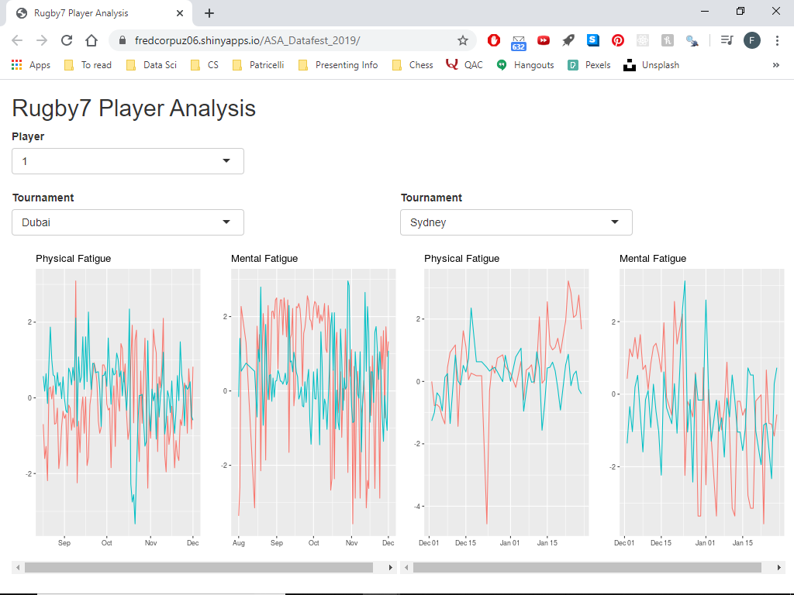

# ASA Datafest 2019
## Challenge: How can we quantify athletic fatigue?

Participants were challenged to analyze human performance data from the Canada women's national rugby team to measure player fatigue and provide the team's coach with recommendations to improve game performance. 

## Solution: Player per Tournament Performance Analysis 

Our team developed a Shiny dashboard for the coach to analyze a player's performance in game *(using GPS and acceleration data from the player's sensors worn during games)* and player's training readiness/fatigue *(using self-reported data and coach assigned workout regimen)*.  We believe that paying careful attention to the data gathered from training sessions and games is essential for sports coaches to design personalized training habits for each of their team players.

👉[See our presentation](https://docs.google.com/presentation/d/1Qq2EdIHjCxT5hdI-aC_XERe6D3GoNwCnsT3aficZUXE/edit?usp=sharing)

## Dashboard Components

### Videos of Game Performance:
In order to give the coach a snapshot view of a player’s performance during the game, we created a minimalist video graphic of their movement throughout. The coach can use this to gain a birds-eye understanding of a player’s match. Created with the gganimate package, the animation displays a player (represented by a point) moving around in space. Speed is indicated by color.

### Training Before Tournament:
This chart gives a snapshot view of a player’s training regimen leading up to a tournament. It also specifies which workouts cause the player to be most fatigued. Fatigue is indicated by color. 

### Mental and Physical Readiness:
We created two plots, Mental and Physical Status respectively, which measure a player’s perceived preparedness before a game. Using principal components analysis, the Mental Status visualizes the player's mood and confidence during their training sessions leading up to a tournament, and the Physical Status visualizes the player's recovery and wellness.
* Physical status
  * PCA1: playerRecovery(Pain, Soreness, SleepHours, SleepQuality)
  * PCA2: playerWellness (Illness, Menstruation, Nutrition)
* Mental status
  * PCA1: playerConfidence (TrainingReadiness + FocusRating + ObjectiveRating)
  * PCA2: playerMood (Irritability + Desire)

## Results
Our team won first place at the American Statistical Association 2019 Datafest competition held at Wesleyan University. [(blog post)](https://newsletter.blogs.wesleyan.edu/2019/04/15/wesleyan-wins-best-in-show-at-2019-datafest/) 

For more information on the American Statistical Association's nationwide Datafest competition, follow [this link](https://ww2.amstat.org/education/datafest/index.cfm).

